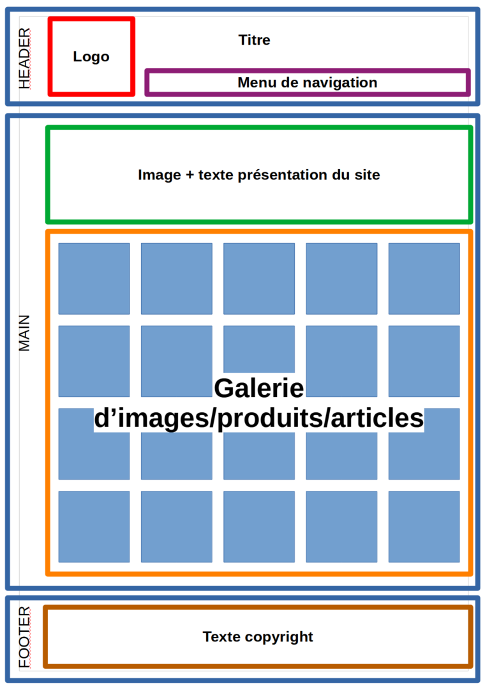
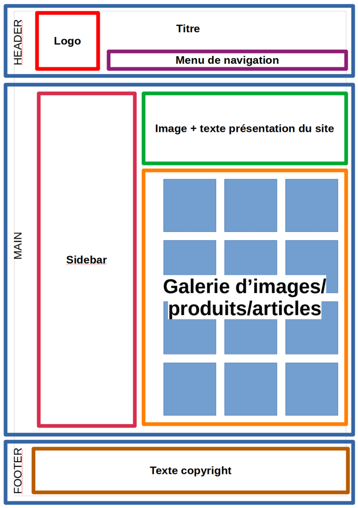
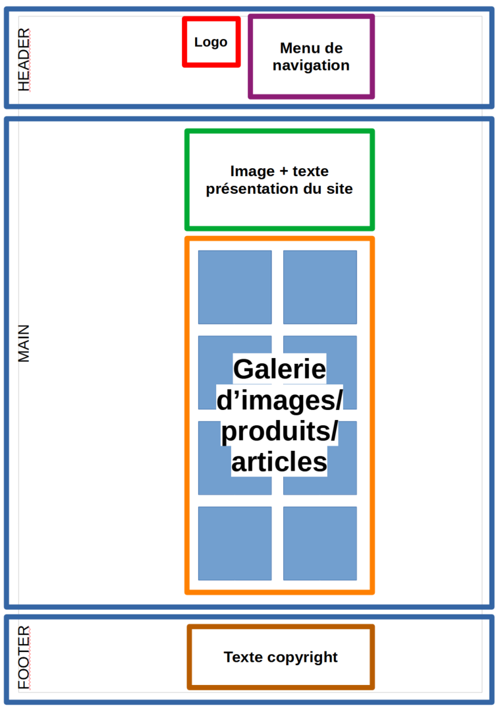

# Projet libre Flexbog/grid

## Instructions
Pour cet exercice, il s’agira d’appliquer les connaissances acquises sur flexbox et grid sur un sujet libre. La seule contrainte sera de respecter la maquette fournie :

- un header qui contient le logo du site, le titre du site et un menu de navigation (vous choisirez les items du menu )

- une partie principale qui contiendra
    - une section de présentation avec un texte introductif (un lorem fera l’affaire si vous n’êtes pas inspirés), et une phto principale en grand format.
    - une section galerie qui contiendra des photos, des produits (avec leur photo si possible) ou encore des articles de blog… Le modèle présente 5 colonnes et 4 lignes d’éléments, mais vous êtes libres d’en mettre plus…

- un footer qui contiendra un texte de copyright ou autre chose si vous avez des idées.

Le thème du site est libre, à vous de choisir ce qui vous inspire : un site de vente en ligne, un blog, un site vitrine...

## Bonus

Ajoutez une sidebar à votre site... pour y mettre par exemple un formulaire de contact ou des catégories d'images/articles...

## Super-bonus
Rendez votre site responsive en essayant de respecter le rendu suivant...

